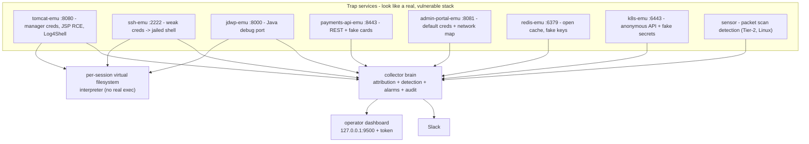

# Core Payment Solution

Core Payment Solution is a merchant payment platform: a payments API, ledger,
admin operations console, and supporting cache and Kubernetes control plane.

> **Authorized use only.** This is a defensive deception/honeypot platform. Deploy only
> on infrastructure you own or operate, to observe attackers interacting with your
> decoys. All planted data is fake; do not add real secrets.

---

## What it actually is

A self-contained set of Go services that look like a vulnerable fintech stack
from the outside, capture everything an intruder does, detect intrusion broadly,
raise Slack alarms, and reconstruct the full audited route each attacker took
across the fake network.



## Components

| Service | Port | Disguise | What it captures |
|---|---|---|---|
| `collector` | 9400 ingest / 9500 dashboard | - | Central brain: persistence, detection, alarms, route audit |
| `ssh-emu` | 2222 | OpenSSH | Credential attempts; weak creds drop into a jailed shell |
| `tomcat-emu` | 8080 | Apache Tomcat 9 | Manager brute force, default creds, JSP/WAR upload, JSP webshell RCE, Log4Shell, traversal |
| `jdwp-emu` | 8000 | Java Debug Wire Protocol | Debugger handshake + every JDWP command (RCE intent) |
| `payments-api-emu` | 8443 | nginx + Spring Boot REST (TLS) | Account/card enumeration, IDOR, injection probes |
| `admin-portal-emu` | 8081 | Internal ops console | Default-credential login; leaks a fake network map |
| `redis-emu` | 6379 | Redis 6 (no auth) | KEYS/GET/CONFIG access to fake secrets |
| `k8s-emu` | 6443 | kube-apiserver (TLS) | Anonymous API access, `get secrets` theft |
| `sensor` | (host net) | - | Tier-2: SYN/FIN/NULL/XMAS scans, port/host sweeps, ping sweeps |

The SSH shell, the Tomcat JSP webshell, and JDWP "exec" all funnel into one
**virtual-filesystem command interpreter** (`internal/sandbox`). It interprets an
allow-list of commands and returns canned output over a planted fake filesystem
seeded with Luhn-valid test cards, fake ledger exports, fake kubeconfigs and
breadcrumbs. It never calls `os/exec` and never runs attacker code on the host.

## Detections

- **Network (Tier-2 sensor, Linux):** TCP SYN / connect / FIN / NULL / XMAS
  scans, port sweeps, host sweeps, ICMP ping sweeps.
- **Application (emulators):** default-credential use, brute force, exploit
  signatures (Tomcat CVE-2017-12617 JSP upload, Log4Shell, path traversal, LFI,
  SQLi, shellshock, JDWP, anonymous k8s API, k8s secret theft), sensitive-data
  and breadcrumb access.
- **Behavioral (collector):** port-scan correlation, brute-force thresholds, and
  **lateral movement** when one source touches multiple machines.

Thresholds and severities live in [`config/honeypot.yaml`](config/honeypot.yaml).

## Alarms and route audit

When a finding crosses the configured minimum severity, the collector raises a
debounced alarm and posts it to Slack. Each attacker is attributed to a session
keyed by source IP; the collector tracks every machine, service, command and
payload as ordered steps. After a session goes idle (`alarm.report_after_idle`)
it emits a full **intrusion report**: the reconstructed route (machine-to-machine
hops), triggered signatures, severities, and the complete timeline. Reports are
posted to Slack and written to `reports/<session>.{json,md}` under the data
directory, and can be pulled live from the operator dashboard.

## Quick start (development, macOS or Linux)

```bash
cp .env.example .env          # set DASHBOARD_TOKEN; optionally SLACK_WEBHOOK_URL
make up                       # build images, start the stack (bridge networking)
make smoke                    # drive an attack and print the reconstructed route
open http://127.0.0.1:9500    # operator dashboard (enter DASHBOARD_TOKEN)
make down
```

On bridge networking every attacker appears as the Docker gateway IP - fine for
development. For real per-attacker attribution, deploy on Linux with host
networking:

```bash
make up-linux                 # docker compose + docker-compose.linux.yml
make sensor                   # Tier-2 packet sensor (Linux + host networking)
```

## Kubernetes (Helm)

The chart lives at [`deploy/helm/core-payment-solution`](deploy/helm/core-payment-solution).
It deploys the collector, every trap emulator as a `LoadBalancer` service (with
`externalTrafficPolicy: Local` for source-IP preservation), and optional Tier-2
emulators plus a host-network packet sensor `DaemonSet`.

**Slack is the notification chain.** Provide your incoming webhook URL at install
time; the collector reads `SLACK_WEBHOOK_URL` from a Kubernetes `Secret` and
posts debounced alarms plus full intrusion route reports.

```bash
# Create namespace
kubectl create namespace honeypot

# Install (replace webhook URL and set your GHCR image if not using defaults)
helm upgrade --install honeypot deploy/helm/core-payment-solution \
  --namespace honeypot \
  --set image.repository=ghcr.io/ankraio/core-payment-solution \
  --set image.tag=0.1.0 \
  --set notifications.slack.webhookUrl='https://hooks.slack.com/services/T.../B.../...' \
  --set secrets.dashboardToken='your-operator-token'

# Enable Tier-2 traps + packet sensor
helm upgrade honeypot deploy/helm/core-payment-solution \
  --namespace honeypot \
  --reuse-values \
  --set tier2.enabled=true \
  --set sensor.enabled=true
```

**Using an existing secret** (recommended for production — webhook never in shell history):

```bash
kubectl create secret generic honeypot-secrets -n honeypot \
  --from-literal=webhook-url='https://hooks.slack.com/services/...' \
  --from-literal=dashboard-token='your-operator-token'

helm upgrade --install honeypot deploy/helm/core-payment-solution \
  --namespace honeypot \
  --set secrets.existingSecret=honeypot-secrets \
  --set notifications.slack.webhookUrl=''
```

Operator dashboard (ClusterIP only — not exposed to attackers):

```bash
kubectl port-forward svc/honeypot-core-payment-solution-dashboard 9500:9500 -n honeypot
open http://127.0.0.1:9500
```

See [`values-production.example.yaml`](deploy/helm/core-payment-solution/values-production.example.yaml)
for a production starting point.

## CI/CD (GitHub Actions)

| Workflow | Trigger | What it does |
|---|---|---|
| [`ci.yml`](.github/workflows/ci.yml) | push/PR to main | `go vet`, `go test`, Docker build (emulator + sensor), `helm lint` |
| [`release.yml`](.github/workflows/release.yml) | tag `v*` | Push images to `ghcr.io`, package Helm chart, attach to GitHub Release |

Release images:

- `ghcr.io/<owner>/<repo>:<version>` — collector + all emulators
- `ghcr.io/<owner>/<repo>-sensor:<version>` — packet sensor (Linux/CGO)

Package the chart locally:

```bash
make helm-lint
make helm-package    # writes dist/core-payment-solution-*.tgz
```

## Operating safely

- **Authorized use only.** Deploy on infrastructure you own/operate, to observe
  attackers already interacting with your decoys. This is a defensive tool.
- **Source reveals the deception.** The cover story protects the deployed
  services, not this repository. Do not deploy trap services without reading
  "Operating safely" below.
- **No real data or secrets.** All planted data is fake. Do not add real secrets.
- **Lock down egress.** Compose cannot restrict per-container egress. On the
  Linux host run [`scripts/egress-firewall.sh`](scripts/egress-firewall.sh) to
  allow outbound only to the Slack webhook host.
- **Dashboard is loopback + token.** It binds `127.0.0.1` and requires
  `DASHBOARD_TOKEN`. Keep it off the trap network.
- **macOS is dev-only.** Real client-IP attribution and the packet sensor
  require Linux; validate them on the deployment target.

## Layout

```
cmd/            collector, sensor, and one main per emulator
internal/       event, transport, store, session, detect, alarm, slack,
                audit, sandbox, deception, certs, emu, config, log, collector
config/         honeypot.yaml (thresholds, alarm rules, banners)
deploy/helm/    Kubernetes Helm chart
.github/        CI and release workflows
scripts/        smoke-test.sh, egress-firewall.sh, package-helm.sh
```

## Tooling

```bash
make build         # go build ./...
make test          # go test ./...   (includes the end-to-end brain test)
make vet           # go vet ./...
make helm-lint     # helm lint deploy/helm/core-payment-solution
make helm-package  # package chart to dist/
```
